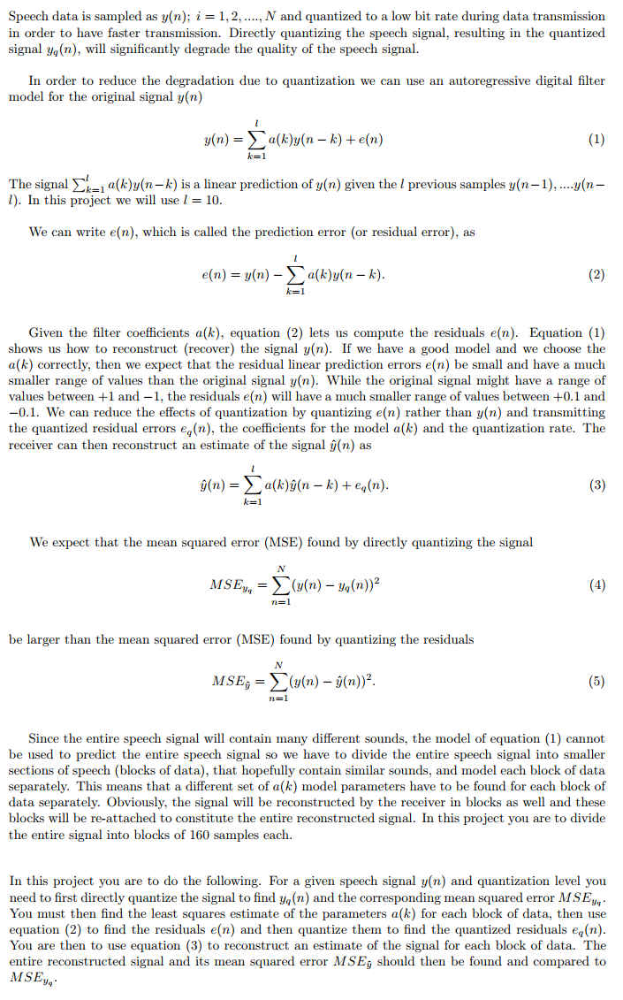

# speech-compression-least-squares
Least Squares Audio and Speech Compression Linear Predictive Coding (LPC)

This was a MATLAB project for Linear Algebra course at Shiraz University which was lectured by Dr. Hamed Masnadi-Shirazi back in Spring 2016 semester. The project guide is also included.
